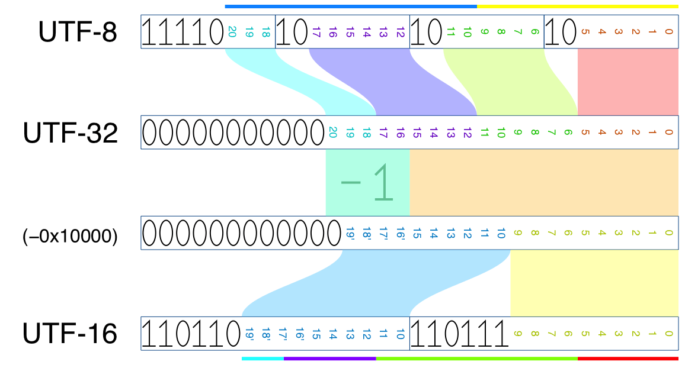
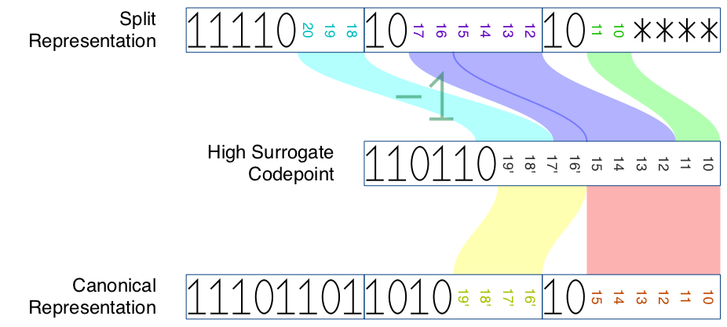
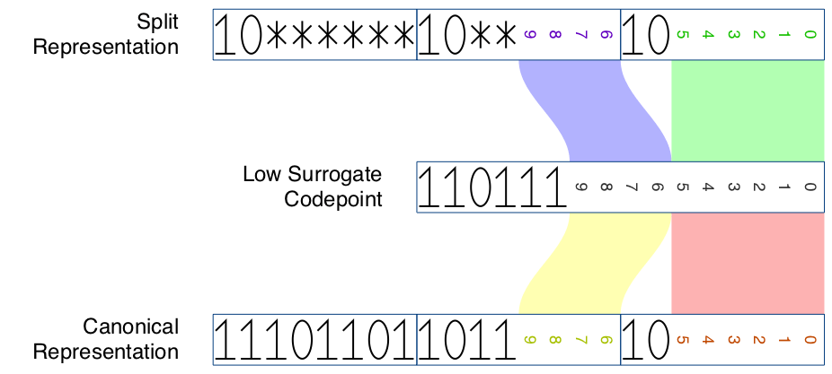

Optimized-Matching-Generalized Wobbly Transformation Format — 8-bit
===================================================================

This package implements the “OMG-[WTF-8]” encoding, making it suitable for use as a pattern via
the “[Pattern 1.5]” API, so it doesn’t need two separate `Pattern` APIs from “[Pattern 2.0]”.

[Pattern 1.5]: https://github.com/rust-lang/rust/issues/27721#issuecomment-185405392
[Pattern 2.0]: https://github.com/rust-lang/rfcs/pull/1309#issuecomment-214030263

Background
----------

### Shortcomings of WTF-8

[WTF-8] extends UTF-8 by allowing a lone surrogate code point using the usual UTF-8 encoding
algorithm similar to [CESU-8], e.g. U+D800 is encoded as the 3-byte sequence `ed a0 80`. Unlike
CESU-8, WTF-8 encodes non-BMP characters as a 4-byte sequence, so conversion from valid UTF-8
sequence is zero-cost.

These two decisions together means we cannot split a well-formed WTF-8 string in the middle of a
surrogate pair, which makes it impossible to implement some common string APIs like `split()`.

```rust
let haystack = OsString::from_wide(&[0xd800, 0xdc00, 0xd800, 0xdc01, 0xd800, 0xdc02]);
let needle = OsString::from_wide(&[0xd800]);
for part in haystack.split(&needle) {
    println!("{:?}", part); // <-- how could we represent `part` as an `&OsStr`?
}
// should print "", "\u{dc00}", "\u{dc01}", "\u{dc02}".
```

### Splitting a Surrogate Pair

The modified WTF-8 encoding addresses this by allowing a 4-byte sequence be split into halves, to
represent a lone surrogate code point at the beginning or end. To see why this is possible, let’s
check the encoding of non-BMP characters in UTF-8, -16 and -32.



In UTF-8, the first byte encode 3 bits, and the next three bytes each encode 6 bits. In UTF-16, each
code unit encodes 10 bits. Therefore, the first 3 bytes of a UTF-8 4-byte sequence are enough to
determine the high surrogate in the corresponding UTF-16 encoding, and the last 2 bytes are enough
to determine the low surrogate.

Therefore, we can split a 4-byte sequence `f0 9f 98 82` into two *overlapping* sub-strings
`f0 9f 98` and `98 82`, each of which is sufficient to determine corresponding surrogate code point,
and thus able to compare with the proper WTF-8 encoding.



For consistency, we will encode the low surrogate using a 3-byte substring instead of 2-.



[WTF-8]: https://simonsapin.github.io/wtf-8/
[CESU-8]: https://www.unicode.org/reports/tr26/

Definitions
-----------

### Terminology

The terminology used in OMG-WTF-8 follows those of
[WTF-8](https://simonsapin.github.io/wtf-8/#terminology).

A Unicode ***code point*** is any value in the Unicode code space. It is written as “U+XXXX”, where
XXXX is a hexadecimal number. A valid code point is in the range U+0000 to U+10FFFF, inclusive.

A ***high surrogate*** is a code point in the range U+D800 to U+DBFF.

A ***low surrogate*** is a code point in the range U+DC00 to U+DFFF.

A ***surrogate*** is either a high surrogate or a low surrogate, i.e. a code point in the range
U+D800 to U+DFFF.

A ***surrogate pair*** is two code points, where the first code point is a high surrogate, and the
second code point is a low surrogate.

An ***unpaired high surrogate*** in a string is a high surrogate *not* followed by a low surrogate.

An ***unpaired low surrogate*** in a string is a low surrogate *not* preceded by a high surrogate.

An ***unpaired surrogate*** is either an unpaired high surrogate or an unpaired low surrogate.

A ***4-byte sequence*** is the UTF-8 encoding of a character in the range U+10000 to U+10FFFF, which
occupies 4 bytes.

A ***3-byte sequence*** is a sequence of 3 consecutive bytes.

The ***canonical representation*** of a surrogate is a 3-byte sequence, generated by encoding the
said code point via generalized UTF-8.

| Canonical representation | Byte 0 | Byte 1    | Byte 2    |
|:-------------------------|:------:|:---------:|:---------:|
| High surrogate           | `ed`   | `a0`–`af` | `80`–`bf` |
| Low surrogate            | `ed`   | `b0`–`bf` | `80`–`bf` |

Every character in the code point range U+10000 to U+10FFFF can be encoded as a surrogate pair in
UTF-16, and as a 4-byte sequence in UTF-8. For this character, the first 3 bytes of the 4-byte
sequence is the high surrogate’s ***split representation***. Similarly, the last 3 bytes of the
4-byte sequence is the low surrogate’s split representation.

| Split representation | Byte 0    | Byte 1    | Byte 2    |
|:---------------------|:---------:|:---------:|:---------:|
| High surrogate       | `f0`      | `90`–`bf` | `80`–`bf` |
| High surrogate       | `f1`–`f3` | `80`–`bf` | `80`–`bf` |
| High surrogate       | `f4`      | `80`–`8f` | `80`–`bf` |
| Low surrogate        | `80`–`bf` | `80`–`bf` | `80`–`bf` |

### OMG-WTF-8

The ***well-formed OMG-WTF-8*** sequence consists of, in order:

1. Zero or one 3-byte sequence at the beginning of the string, which is the split representation of
    a low surrogate,
2. A well-formed WTF-8 sequence, and
3. Zero or one 3-byte sequence at the end of the string, which is the split representation of a high
    surrogate.

Thus, any well-formed WTF-8 string is a well-formed OMG-WTF-8 sequence.

A surrogate in split representation can never appear in the middle of an OMG-WTF-8 sequence. A high
surrogate in split representation can only appear at the end of the string, and a low surrogate in
split representation can only appear at the beginning of the string.

***Canonicalization*** is a process which converts a 3-byte sequence from split representation to
canonical representation. This process can be done in-place.

Any well-formed OMG-WTF-8 sequence can be converted to a well-formed WTF-8 sequence by
canonicalization. Since split-representation surrogates can only appear at either ends of the
string, canonicalization is O(1) and is very cheap.

OMG-WTF-8 strings are hashed and compared-with-equality through its canonicalization. The ordering
of OMG-WTF-8 strings should be compatible with well-formed *UTF-8*. When unpaired surrogates appear,
the actual ordering is unspecified. Nevertheless, OMG-WTF-8 should be totally ordered.

OMG-WTF-8 must be converted to WTF-8 when stored.

### Slicing

It is possible to slice a well-formed OMG-WTF-8 string `s[i..j]`. In order to maintain
well-formed-ness, the resulting string may be longer than `j - i`.

The index can point at the middle of a 4-byte sequence, e.g.

```rust
let s = OmgWtf8::from_str("\u{10000}");
let first_half = &s[..2];   // valid, returns the 3-byte sequence "\xf0\x90\x80".
let second_half = &s[2..];  // valid, returns the 3-byte sequence "\x90\x80\x80".
let empty_str = &s[2..2];   // valid, returns an empty string "".
```

Pointing to the middle of a 3-byte sequence is always an error.

Because of the overlapping, it is unsafe to split a mutable OMG-WTF-8 string. We recommend only use
OMG-WTF-8 in immutable case, and convert to WTF-8 if mutable access is needed.

### Matching

An OMG-WTF-8 sequence can be used as a needle for string matching. When matching, transform any
unpaired low surrogate at the beginning (no matter in what representation) into a regular expression
like this:

```regex
(\xed\xb0\x80|[\x80-\xbf][\x80\x90\xa0\xb0]\x80)
```

and transform any unpaired high surrogate at the end (no matter in what representation) into a
regular expression like this:

```regex
(\xed\xa0\x80|\xf0\x90[\x80-\x8f])
```

The WTF-8 sequence in the middle is matched byte-for-byte.

After a match is found, the cursor may potentially point to byte 1 or byte 3 of a 4-byte sequence.
In that case, the index needs to be readjusted to point to byte 2. The cursor itself may also needs
to move backward by 2 bytes for the next match, e.g. searching for `\u{dc00}\u{d800}` inside
`\u{10000}\u{10000}\u{10000}` should yield 2 matches at `2..6` and `6..10`.

This package
------------

The `omgwtf8` package is a demo showing the concept does work. This is not implemented for
performance nor feature completeness.